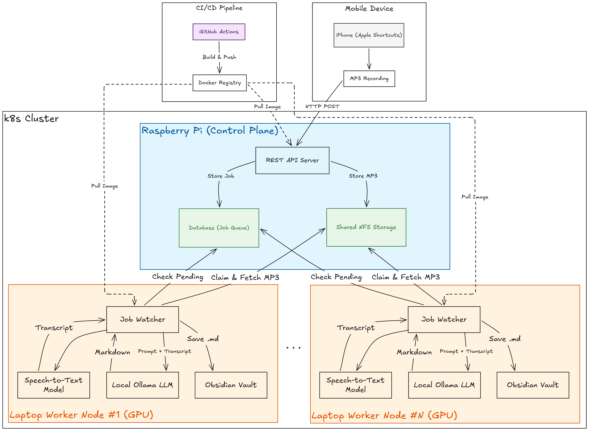

# EchoBind

EchoBind is a personal lecture and meeting transcription assistant designed to help capture important information from audio recordings and generate organized notes.

The goal of this project is to create a system that can process recorded lectures, meetings, and discussions into searchable transcripts and AI-generated summaries. The generated notes are intended to supplement personal note-taking by identifying missed details, important context, and key discussion points.

## Why I Built This

<!-- TODO: fill in -->

## Overview

EchoBind runs as a distributed system across a small home cluster:

- A **Raspberry Pi 4** acts as the control plane and hosts a lightweight REST API, a job queue, and shared NFS storage.
- Audio is submitted from a **mobile device** (via Apple Shortcuts) or built and pushed through a **CI/CD pipeline**, and lands on the API server.
- One or more **laptop worker nodes**, each with a GPU, poll the API for pending jobs, pull down the audio, transcribe it locally with Whisper, summarize it with a local Ollama model, and save the result into an Obsidian vault.
- Laptops are treated as **intermittent compute** — they can close, sleep, and reconnect without breaking the system. Jobs left unclaimed past a timeout are requeued automatically.

## Architecture Diagram


## Features (Planned)

- Upload audio recordings for processing
- Convert audio recordings into text transcripts
- Generate structured notes and summaries using local AI models
- Maintain a history of processed recordings and generated outputs
- Distributed, GPU-accelerated transcription across multiple worker nodes
- Resilient to worker nodes going offline mid-job (automatic requeue)

## Technologies Used

### Backend
- Python
- FastAPI
- SQLAlchemy
- SQLite

### AI / Machine Learning
- Whisper for speech-to-text transcription
- Ollama for local large language model inference

### Infrastructure
- Docker
- Kubernetes (k3s)
- Tailscale (mesh networking between nodes)
- Linux
- Raspberry Pi

### Development Tools
- Git
- uv (Python package management)

## Project Status

Currently under active development. Future development will focus on transcription processing, AI summarization, and deployment workflows.

## Architecture Assumptions

These assumptions are baked into the current manifests and setup instructions below. If your setup differs, adjust accordingly:

- **The control plane is a single Raspberry Pi 4**, running `k3s server`. It is tainted so no application pods land there except the API server.
- **Worker nodes are laptops that are not always on.** They join the cluster as `k3s agent` nodes and are expected to go `NotReady` when closed and rejoin automatically when opened. Workers run as a **DaemonSet**, not a scaled Deployment — each node is treated as distinct (its own local Obsidian vault, its own model cache), not an interchangeable replica.
- **All nodes communicate over a Tailscale mesh network**, not the local LAN. This means workers can be off-site and still join/reach the cluster. Node IPs, NFS server addresses, and Ollama hosts should all use Tailscale IPs or MagicDNS names — not `.local` mDNS names, which only resolve on the same LAN.
- **Worker nodes have an NVIDIA GPU** and the NVIDIA Container Toolkit installed, with a Kubernetes `RuntimeClass` named `nvidia` configured. Without this, worker pods will schedule but silently run on CPU only (or fail to see the GPU library at all).
- **The Pi and laptops are different CPU architectures** (arm64 vs amd64). Container images are built per-architecture, and node labels/selectors route the right image to the right node type.

## Getting Started

### Prerequisites

- A Raspberry Pi 4 (recommended: 4GB+ RAM), running a 64-bit OS
- One or more Linux laptops with an NVIDIA GPU
- A [Tailscale](https://tailscale.com) account
- Docker (for local development)
- `kubectl`

### 1. Set up the Tailscale mesh

Install and authenticate Tailscale on the Pi and every laptop:

```bash
curl -fsSL https://tailscale.com/install.sh | sh
sudo tailscale up
```

Note each device's Tailscale IP (`tailscale ip -4`) — you'll need the Pi's for the steps below.

### 2. Install k3s on the Raspberry Pi (control plane)

```bash
curl -sfL https://get.k3s.io | sh -s - server \
  --node-taint node-role.kubernetes.io/control-plane=true:NoSchedule \
  --node-ip=<pi-tailscale-ip> \
  --advertise-address=<pi-tailscale-ip> \
  --flannel-iface=tailscale0 \
  --tls-san=<pi-tailscale-ip>
```

Retrieve the join token for the next step:

```bash
sudo cat /var/lib/rancher/k3s/server/node-token
```

### 3. Join each laptop as a worker node

Install the NVIDIA driver and Container Toolkit first, then join the cluster:

```bash
curl -sfL https://get.k3s.io | \
  K3S_URL=https://<pi-tailscale-ip>:6443 \
  K3S_TOKEN=<token> sh -s - agent \
  --vpn-auth="name=tailscale,joinKey=<tailscale-authkey>" \
  --node-label role=worker \
  --node-label gpu=nvidia
```

Configure containerd to use the NVIDIA runtime, then create the `nvidia` `RuntimeClass`:

```bash
sudo nvidia-ctk runtime configure --runtime=containerd \
  --config=/var/lib/rancher/k3s/agent/etc/containerd/config.toml.tmpl
sudo systemctl restart k3s-agent
```

```bash
kubectl apply -f - <<'EOF'
apiVersion: node.k8s.io/v1
kind: RuntimeClass
metadata:
  name: nvidia
handler: nvidia
EOF
```

Deploy the NVIDIA device plugin so pods can request `nvidia.com/gpu`:

```bash
kubectl apply -f https://raw.githubusercontent.com/NVIDIA/k8s-device-plugin/v0.15.0/deployments/static/nvidia-device-plugin.yml
```

Confirm both nodes are ready:

```bash
kubectl get nodes -o wide
```

### 4. Deploy EchoBind

Edit `src/k8s/echobind.yaml`, replacing `YOUR_DOCKERHUB_USERNAME` with your registry, then apply:

```bash
kubectl apply -f src/k8s/echobind.yaml
kubectl get pods -o wide -w
```

You should see the API pod scheduled on the Pi, and a worker pod automatically created on every node labeled `role=worker`.

## Running locally with Docker Compose

The repo also includes a Compose file that mounts your shared storage at `/mnt/echobind-storage` into both the API and worker containers, for local development without a full cluster.

```bash
docker compose up --build
```

Set `ECHOBIND_STORAGE_ROOT` if you want to point at a different shared path.

## Kubernetes

The full Kubernetes manifest is available in `src/k8s/echobind.yaml`. It includes:

- `PersistentVolume` / `PersistentVolumeClaim` for shared NFS storage
- A `ConfigMap` with shared environment configuration
- An `echobind-api` `Deployment` (single replica, pinned to the Pi via `nodeSelector`)
- An `echobind-worker` `DaemonSet` (one pod per node labeled `role=worker, gpu=nvidia`, using `runtimeClassName: nvidia`)
- A `NodePort` `Service` exposing the API on port `30080`

Current assumptions baked into that manifest:

- The k3s control plane runs on the Raspberry Pi (Tailscale hostname `raspberrypi`).
- Shared storage is exported from the Pi over its Tailscale IP and mounted at `/mnt/echobind-storage`.
- API pods stay pinned to the Pi node via `nodeSelector` + a toleration for the control-plane taint.
- The API is exposed on port `30080` via `NodePort`.
- Images are tagged as `release` in the GitHub push workflow.
- Worker pods request `nvidia.com/gpu: 1` and run on CUDA-capable nodes labeled `role=worker, gpu=nvidia`.
- `OLLAMA_HOST` is set to the Pi's Tailscale IP so it resolves whether or not workers are on the same LAN.

Replace `YOUR_DOCKERHUB_USERNAME` with your Docker Hub username before applying it.

## Worker resilience

The worker is designed to handle transient node or network failures — laptops closing, sleeping, or losing connectivity mid-job. If a worker goes offline while it has claimed a job, the job is requeued after a configurable timeout so another worker can pick it up.

You can tune the behavior with:

- `WORKER_POLL_INTERVAL_SECONDS`
- `WORKER_HEARTBEAT_INTERVAL_SECONDS`
- `JOB_REQUEUE_TIMEOUT_MINUTES`

## Adding another worker node

Because workers run as a DaemonSet targeting `role=worker, gpu=nvidia`, adding a new laptop requires no manifest changes:

1. Install Tailscale and authenticate.
2. Install the NVIDIA driver and Container Toolkit.
3. Join the cluster with `k3s agent` as in step 3 above.
4. Configure the NVIDIA containerd runtime and restart the agent.

The worker pod will be scheduled automatically once the node reports `Ready` with the correct labels.